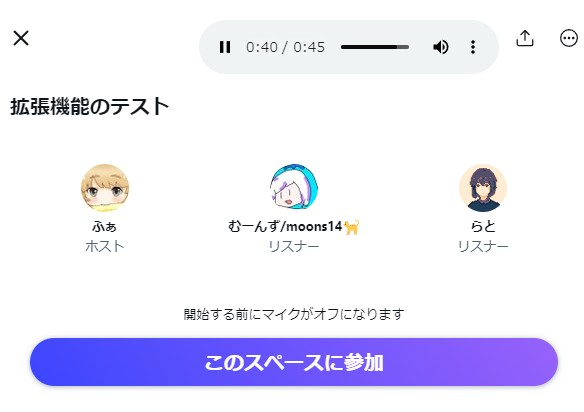

# TwitterSpacesWiretapExtension


Twitter のスペースに参加せずに試し聞きできる Chrome 拡張機能<br>
A Chrome extension for listening in on Twitter Spaces without joining<br>



Python version: [TwitterSpacesWiretap](https://github.com/fa0311/TwitterSpacesWiretap)<br>

## インストール

[ChromeWebStore](https://chrome.google.com/webstore/detail/twitterspaceswiretapexten/hajmblnifbebpjbbepklinmlbillcbni?hl=ja&authuser=0)

もしくは

[releases](https://github.com/fa0311/TwitterSpacesWiretapExtension/releases) の `TwitterSpacesWiretapExtension.zip` を選択してファイルをダウンロード<br>
Chrome の `拡張機能の管理` を選択して `デベロッパーモード` を有効にした後、`パッケージ化されていない拡張機能を読み込む` を選択してダウンロードした zip ファイルを選択してください。


## Installation

[ChromeWebStore](https://chrome.google.com/webstore/detail/twitterspaceswiretapexten/hajmblnifbebpjbbepklinmlbillcbni?hl=ja&authuser=0)


or

Select TwitterSpacesWiretapExtension.zip from [releases](https://github.com/fa0311/TwitterSpacesWiretapExtension/releases) to download the file. Then, select Manage Extensions in Chrome, enable Developer Mode, and choose Load unpacked extension, then select the downloaded zip file.

## ffmpeg での録音

スペースを開いて `F12` を押して開発者ツールを開きます。

```log
https://xxxxxxxxxxxxx.video.pscp.tv/Transcoding/v1/hls/xxxxxxxxxxxxx/non_transcode/xxxxxxxxxxxxx/xxxxxxxxxxxxx/audio-space/dynamic_playlist.m3u8?type=live
```

上記の URL が表示されるので、この URL をコピーしてください。

```bash
ffmpeg -i https://xxxxxxxxxxxxx.video.pscp.tv/Transcoding/v1/hls/xxxxxxxxxxxxx/non_transcode/xxxxxxxxxxxxx/xxxxxxxxxxxxx/audio-space/dynamic_playlist.m3u8?type=live -c copy output.mp3
```

上記のコマンドを実行すると、スペースの音声が録音されます。

## Recording with ffmpeg

Open the Space and press F12 to open the developer tools.

```log
https://xxxxxxxxxxxxx.video.pscp.tv/Transcoding/v1/hls/xxxxxxxxxxxxx/non_transcode/xxxxxxxxxxxxx/xxxxxxxxxxxxx/audio-space/dynamic_playlist.m3u8?type=live
```

Copy the URL above.

```bash
ffmpeg -i https://xxxxxxxxxxxxx.video.pscp.tv/Transcoding/v1/hls/xxxxxxxxxxxxx/non_transcode/xxxxxxxxxxxxx/xxxxxxxxxxxxx/audio-space/dynamic_playlist.m3u8?type=live -c copy output.mp3
```

Executing the above command will record the audio of the Space.

## License

TwitterSpacesWiretapExtension is under MIT License
